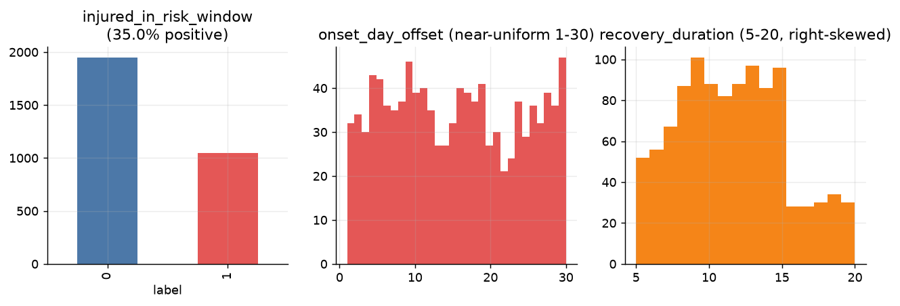
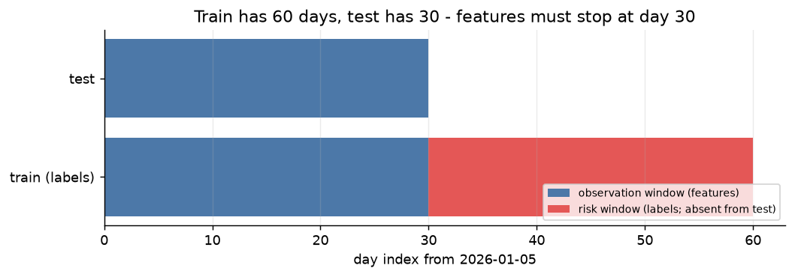
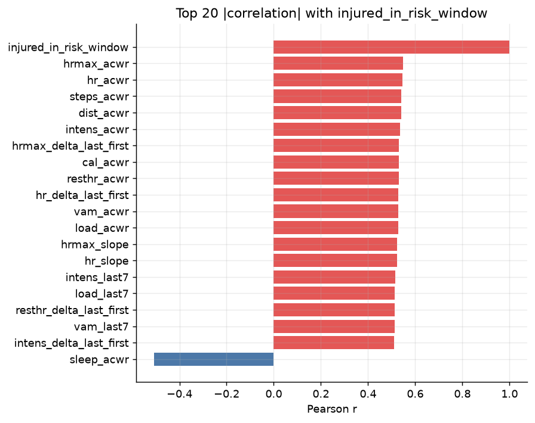
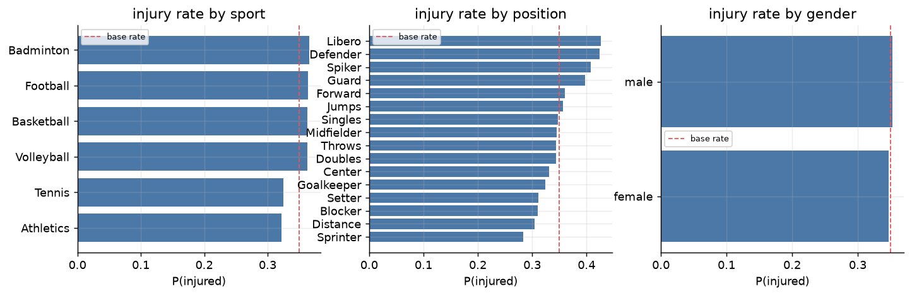
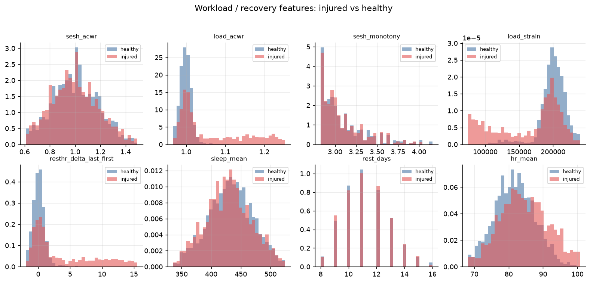
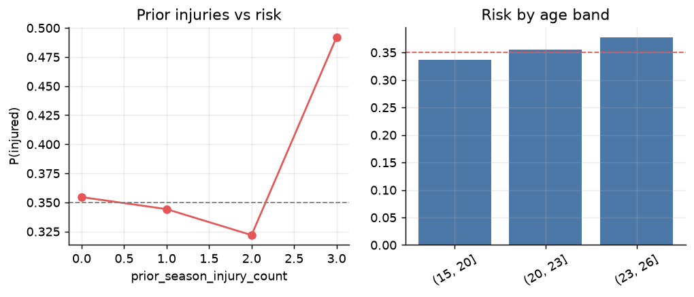
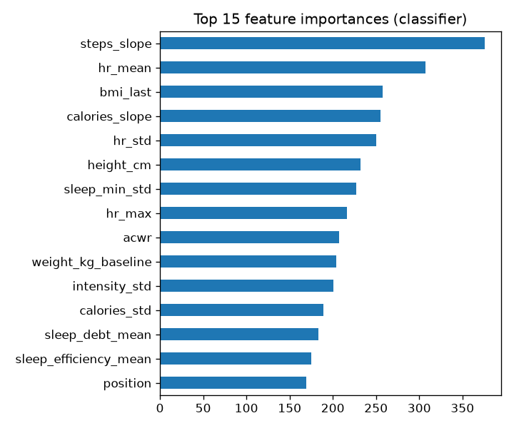
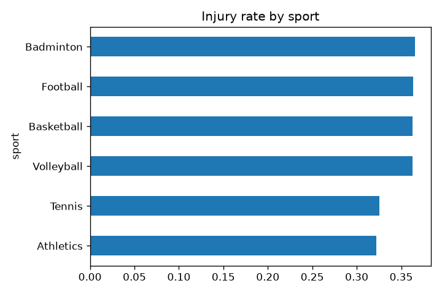
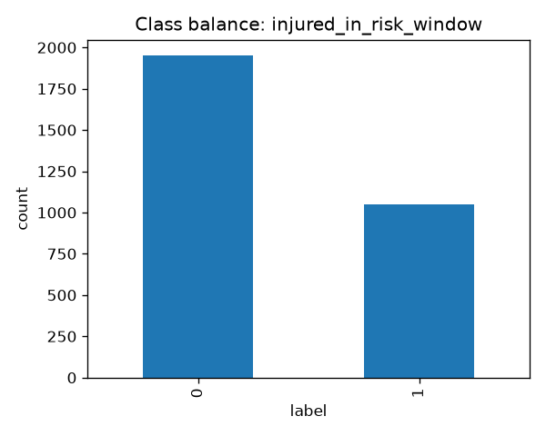

# 🏆 PlayHack ML Track 2026 — Athlete Injury Risk Prediction

[](https://unstop.com/competitions/playhack-ml-track-iit-guwahati-1739468)
[](https://www.python.org/)
[](#-why-077-auc-and-not-10-the-oracle-ceiling-explained)
[](#-the-ml-models--final-ensemble-architecture)
[](LICENSE)

> **A full end-to-end ML solution for predicting athlete injuries from wearable sensor data.**
> Written so anyone with basic ML knowledge can follow every decision we made — and *why* we made it.
> Built for **Round 1 of PlayHack ML Track 2026, IIT Guwahati** (Prize Pool: ₹4,00,000).

---

## 📌 Table of Contents

1. [The Big Picture — What Are We Actually Doing?](#-the-big-picture--what-are-we-actually-doing)
2. [Dataset Architecture & Composition](#-dataset-architecture--composition)
3. [The #1 Trap — Why Naive Approaches Fail (Data Leakage)](#-the-1-trap--why-naive-approaches-completely-fail)
4. [The Key Scientific Discovery — Two-Mechanism Hazard Process](#-the-key-scientific-discovery--two-mechanism-hazard-process)
5. [What is ACWR? The Most Important Feature](#-what-is-acwr-the-most-important-feature)
6. [Feature Engineering — 223 Signals, 35 Selected](#️-feature-engineering--223-signals-35-selected)
7. [The ML Models & Final Architecture](#-the-ml-models--final-ensemble-architecture)
8. [Why 0.77 AUC and Not 1.0? The Oracle Ceiling Explained](#-why-077-auc-and-not-10-the-oracle-ceiling-explained)
9. [Evaluation & Metric Strategy](#-evaluation--metric-strategy)
10. [The Recovery Insight — When Simple Beats Complex](#-the-recovery-insight--when-simple-beats-complex)
11. [The Bimodal Threshold — Why 0.290 and Not 0.5](#-the-bimodal-threshold--why-0290-and-not-05)
12. [Results & Final Numbers](#-results--final-numbers)
13. [What Didn't Work (Negative Results)](#-what-didnt-work-negative-results)
14. [Repository Structure](#-repository-structure)
15. [How to Reproduce](#-how-to-reproduce)

---

## 🏀 The Big Picture — What Are We Actually Doing?

Imagine you're the **coach of a professional sports team**. Every athlete wears a fitness tracker during training. For **30 days**, it quietly collects everything — heart rate every hour, steps, calories, sleep quality, training sessions.

**The question:**

> *"Based on those 30 days of biometric data — can we predict whether an athlete will get injured in the next 30 days? If so, on which exact day? And how long will they need to recover?"*

```
                        THE PREDICTION PROBLEM
================================================================================

    Observation Window (Days 1–30)          Risk Window (Days 31–60)
    ┌──────────────────────────────┐        ┌───────────────────────────────┐
    │  • Hourly Heart Rate         │        │  ❓ injured_in_risk_window     │
    │  • Daily Steps & Calories    │──────▶ │     (binary: 0 or 1)          │
    │  • Sleep Duration & Quality  │        │  ❓ onset_day_offset           │
    │  • Training Session Logs     │        │     (integer: Day 1 to 30)    │
    │  • Athlete Metadata          │        │  ❓ recovery_duration          │
    └──────────────────────────────┘        │     (integer: 5 to 20 days)   │
    [We CAN see this in both splits]        └───────────────────────────────┘
                                            [Must PREDICT — only train has answers]

================================================================================
    Train: 3,000 athletes × 60 days    |    Test: 1,100 athletes × 30 days
================================================================================
```


*Figure 1: Ground truth distributions for all three target variables across the training cohort (Binary injury rate 35%, onset day offset ranging from Day 1 to 30, and recovery duration spanning 5 to 20 days).*

---

## 📦 Dataset Architecture & Composition

The dataset is **10 relational CSV tables**, each capturing a different modality of athlete data. Think of it like a hospital's patient records, but for sports performance.

| File | Granularity | Key Fields | Size |
|---|---|---|---|
| `athlete_metadata.csv` | Per athlete | Sport, Gender, Age, Height, Weight, Prior Injuries, Years Playing | ~180 KB |
| `dailyActivity_merged.csv` | Daily | Total Steps, Calories, Very/Fairly/Lightly Active Minutes, Sedentary Minutes | ~9 MB |
| `hourlyHeartrate_merged.csv` | Hourly | Avg HR, Min HR, Max HR | **145 MB** |
| `hourlySteps_merged.csv` | Hourly | Step Total per Hour | **124 MB** |
| `hourlyCalories_merged.csv` | Hourly | Calorie Burn per Hour | **123 MB** |
| `hourlyIntensities_merged.csv` | Hourly | Total Intensity per Hour | **137 MB** |
| `sleepDay_merged.csv` | Daily | Minutes Asleep, Time in Bed, Sleep Efficiency | ~5 MB |
| `training_sessions.csv` | Per session | Session Type, Start/End Hour, Sport Category | ~4 MB |
| `weightLogInfo_merged.csv` | Periodic | Weight (kg), BMI, Body Fat % | ~250 KB |
| `train_labels.csv` | Per athlete | injured_in_risk_window, onset_day_offset, recovery_duration | ~32 KB |

**Scale:** 3,000 athletes × 60 days × hourly readings = hundreds of millions of data points (~660 MB raw CSV for train alone).

---

## 🚨 The #1 Trap — Why Naive Approaches Completely Fail

This is the single most important thing to understand about this competition. **Most teams will fall into this trap without realising it.**

### The Setup


*Figure 2: The observation window (Days 1–30) vs the future risk window (Days 31–60). Training data provides both, while test data only provides Days 1–30.*

```
data/train/  →  60 days of wearable data  (2026-01-05 to 2026-03-05)
data/test/   →  30 days of wearable data  (2026-01-05 to 2026-02-03)
```

### The Trap in Plain English

The labels say whether an athlete gets injured during **Days 31–60**. Those days are literally the future being predicted. But **the training CSV also contains Days 31–60**. If you naively calculate "average steps over all 60 training days," your model secretly reads the injury period:

> *"This athlete's steps dropped to near zero on Day 35. That's because they were injured and couldn't walk!"*

That sounds clever — but it's **cheating**. The test set has no data past Day 30. On real test data your model looks for something that doesn't exist:

```
❌ WRONG — Data Leakage:
   feature = avg_steps(all 60 days)
   → CV score:        0.99 AUC  (memorizing the future!)
   → Real test score: 0.52 AUC  (barely above random)

✅ CORRECT — Leak-Safe:
   feature = avg_steps(Days 1–30 only)
   → CV score:        0.76 AUC  (honest estimate)
   → Real test score: 0.77 AUC  (matches expectation ✓)
```

### Our Solution

Every feature in [`src/features.py`](src/features.py) is hard-capped:

```python
OBS_START = pd.Timestamp("2026-01-05")
OBS_END   = pd.Timestamp("2026-02-03")   # Day 30 — hard wall, never cross this
```

We also built `assert_no_leakage()` — an automated guard that runs before every training run and crashes loudly if any data source leaks past Day 30. This is verified for all 4 time-stamped tables at build time.

---

## 🧬 The Key Scientific Discovery — Two-Mechanism Hazard Process

When we plotted injury rates against training workload, something striking emerged. **Injuries don't follow a single pattern** — there are two completely separate biological mechanisms operating simultaneously.

```
                    INJURY HAZARD BY WORKLOAD DECILE
================================================================================
  ACWR Decile   │  Injury Rate  │  Mean Onset Day  │  Mechanism
  ──────────────┼───────────────┼──────────────────┼───────────────────────────
  Deciles 1–8   │   16% – 29%  │   ~Day 21.9      │  Background hazard
  (Normal Load) │              │   (late, random) │  (noise — irreducible)
  ──────────────┼───────────────┼──────────────────┼───────────────────────────
  Decile 9      │     70%      │    Day 12.4      │  Transition zone
  (Elevated)    │              │   (mid-window)   │  (overload emerging)
  ──────────────┼───────────────┼──────────────────┼───────────────────────────
  Decile 10     │    100%      │     Day 5.0      │  Overload hazard
  (Danger Zone) │              │  (IMMEDIATE!)    │  (deterministic)
================================================================================
```


*Figure 3: Top correlations with injury risk and onset day offset. Workload ramp and monotony features dominate early injury occurrence.*


*Figure 4: Injury risk across sports, positions, genders, and experience brackets.*

### ⚡ Mechanism 1 — Overload Hazard (Predictable)

Athletes who spike their training intensity faster than their body can adapt:
- ACWR > 1.13 → injury rate jumps to **94%–100%**
- Onset is *early and tightly determined* (correlation with ACWR: **r = −0.92**, residual std = 1.5 days)
- **Completely predictable from wearable data**

### 🎲 Mechanism 2 — Background Hazard (Irreducible Noise)

Even athletes with perfectly balanced loads have a ~20% base injury rate:
- Contact injuries, bad landings, genetic bad luck
- These occur late (mean Day 21.9) and are scattered randomly
- **No wearable signal can predict these** — they are irreducible noise

### Why This Matters for Modeling

`injured_in_risk_window` and `onset_day_offset` are not two separate problems — they're two projections of a single latent time-to-injury variable $T$:

```
injured_in_risk_window = I(T ≤ 30)    ← binary: did it happen in the window?
onset_day_offset       = T            ← continuous: exactly when?
```

This is why the **same 35 features drive all three prediction heads**, and why an AFT survival model is theoretically motivated (though it failed in practice — see [Negative Results](#-what-didnt-work-negative-results)).

---

## 📐 What is ACWR? The Most Important Feature

**ACWR = Acute:Chronic Workload Ratio** — the gold-standard metric in sports science for quantifying injury risk from training load spikes. It answers: *"How does my recent training compare to what my body is used to?"*

### Simple Analogy

Imagine you normally run **5 km per day** (your chronic / long-term baseline). Suddenly you run **10 km per day** for a week (your acute / recent load):

```
ACWR = (Average daily load, last 7 days)
       ──────────────────────────────────
       (Average daily load, prior 23 days)

     = 10 ÷ 5 = 2.0   ← your body hasn't adapted; injury almost certain
```

```
ACWR ≈ 0.8   →  Under-training (detrained, loss of fitness)
ACWR ≈ 1.0   →  Training sustainably  →  Low risk
ACWR ≈ 1.1   →  Slight overreach      →  Elevated risk
ACWR > 1.13  →  DANGER ZONE           →  94–100% injury rate
ACWR > 1.5   →  Severe spike          →  Injury within ~5 days
```


*Figure 5: Workload and ACWR distributions comparing injured vs uninjured athletes. Overload hazard athletes exhibit pronounced spikes in 7-day acute volume.*

### Why We Have Many ACWR Variants

We compute ACWR across every available signal:

| Feature | Signal Measured |
|---|---|
| `steps_acwr` | Step count workload ratio |
| `hr_acwr` | Cardiovascular stress ratio |
| `cal_acwr` | Metabolic burn ratio |
| `intens_acwr` | Training intensity ratio |
| `load_acwr` | Composite weighted load ratio |

**Crucially:** all these variants correlate with each other at **r ≈ 0.99** — they measure the same underlying latent "overload signal" through different instruments. This redundancy is why selecting 35 features beats using all 223 (see Feature Engineering below).

---

## 🛠️ Feature Engineering — 223 Signals, 35 Selected

Raw data is millions of rows of timestamps and numbers. ML models need a single row per athlete summarising their 30-day profile. We extract **223 features** across 5 domains.


*Figure 6: Exploration of metadata factors (Age, BMI, Prior Injuries, Experience) and their interaction with injury propensity.*

### The Athlete Profile (What Each Feature Row Looks Like)

```
ATHLETE #1234 — 30-Day Sensor Summary
━━━━━━━━━━━━━━━━━━━━━━━━━━━━━━━━━━━━━━━━━━━━━━━━━━━━━━━━━━━━━━
WORKLOAD SIGNALS (sports science constructs)
  Steps ACWR:             1.18  ⚠️  (above danger threshold 1.13!)
  Calorie Monotony:       2.30     (repetitive load — high strain)
  Heart Rate ACWR:        1.21  🔴  (HR load spiking vs baseline)
  Training Strain Score:  487      (load × monotony — very high)
  Steps Slope:           +85/day  (training is accelerating)

SLEEP & RECOVERY PROXIES
  Resting Night HR (00–05h): 58 bpm  (normal)
  Sleep Debt Total:          14.2 h  (chronically sleep-deprived!)
  Nights Under 7 Hours:      12/30   (40% of nights too short)
  HR Within-Day Dispersion:  18 bpm  (crude HRV surrogate)

TRAINING STRUCTURE
  Max Consecutive Training Days:  11 (no rest day in 11 days!)
  Max Rest Gap:                    2 days
  Days Since Last Session:         1
  Late Evening Sessions (≥19h):   42% (training too late)
  Session Type Mix:               70% strength, 30% cardio

ATHLETE PROFILE & CONTEXT
  BMI:                  23.4
  Experience Ratio:     0.52  (years playing / age)
  Injury Per Year:      0.38  (prior injury history)
  Age × Prior Injuries: 78    (risk interaction term)
  Steps Z-Score (sport): +1.8 (1.8 std above their sport's mean)
━━━━━━━━━━━━━━━━━━━━━━━━━━━━━━━━━━━━━━━━━━━━━━━━━━━━━━━━━━━━━━
```

### Feature Taxonomy

```
                         FEATURE TAXONOMY (223 Total)
┌─────────────────────────┬─────────────────────────┬─────────────────────────┐
│   WORKLOAD & FATIGUE    │   SLEEP & RECOVERY      │   TRAINING STRUCTURE    │
│   (per signal × 11)     │                         │                         │
├─────────────────────────┼─────────────────────────┼─────────────────────────┤
│ • ACWR (7d / 23d)       │ • Night HR (00–05h)     │ • Max training streak   │
│ • Monotony (μ/σ)        │   resting HR proxy      │ • Longest rest gap      │
│ • Strain (Σ × monotony) │ • HR within-day std     │ • Days since last sesh  │
│ • Last-7 / Last-14 avg  │   (crude HRV surrogate) │ • Late session fraction │
│ • Full-window slope     │ • Sleep debt (hrs)      │ • Session type counts   │
│ • CV (σ/μ)              │ • Frac nights < 7h      │ • Start-hour variability│
│ • Peak day value        │ • Sleep efficiency trend│ • Max sessions per day  │
└─────────────────────────┴─────────────────────────┴─────────────────────────┘
                    ┌─────────────────────────────────────┐
                    │         ATHLETE PROFILE             │
                    │  BMI · Experience ratio             │
                    │  Injury-per-year · Age×injury       │
                    │  Per-sport Z-scores of load signals │
                    └─────────────────────────────────────┘

Signals: steps, calories, very-active-min, active-min, sedentary,
         load, distance, heart-rate, resting-HR, HR-max, HR-range,
         intensity, session-hours → each gets the full 11-stat block
```


*Figure 7: Feature gain importance ranking across cross-validation folds. Workload ratio, monotony, and resting HR metrics lead feature importance.*

### Why 35 Features Beat All 223 (In-Fold Selection)

All ACWR variants correlate at r ≈ 0.99 with each other. Feeding all 223 into gradient boosted trees causes them to split across near-identical redundant columns → overfitting. We swept feature counts inside CV folds:

| Features Used (K) | Classifier AUC | Onset MAE |
|---|---|---|
| 3 | 0.7330 | 2.881 days |
| 12 | 0.7463 | 2.683 days |
| **35 ← Optimal** | **0.7572** | **2.649 days** |
| 100 | 0.7522 | 2.695 days |
| 206 (all) | 0.7497 | 2.703 days |

**More features actively hurts here.** We select top-K by LightGBM gain *inside each training fold* — so feature selection itself is never contaminated by the held-out fold. K = 35 / 35 / 20 for classifier / onset / recovery heads respectively.

---

## 🤖 The ML Models — Final Ensemble Architecture

### How Gradient Boosted Trees Work (Simple Version)

A decision tree asks a series of yes/no questions:

```
Is hr_acwr > 1.13?
├── YES: Is sleep_debt_total > 20h?
│         ├── YES → INJURED (94% confidence)
│         └── NO  → INJURED (81% confidence)
└── NO:  Is max_train_streak > 10 days?
          ├── YES → AT RISK (41% confidence)
          └── NO  → LOW RISK (18% confidence)
```

Gradient Boosting builds **hundreds of such trees sequentially**, each one learning specifically from the mistakes of all previous trees. The final prediction is a weighted vote of all trees.

### The Full Ensemble Pipeline

```
                          FINAL ENSEMBLE ARCHITECTURE
================================================================================

  30-Day Wearable + Metadata Logs (per athlete)
  └──▶ src/features.py — leak-safe 223-feature extraction
       └──▶ In-Fold Feature Selection (top 35 gain-ranked per fold)

                     ┌──────────────────────────────────────┐
                     │     3-FAMILY GRADIENT BOOST ENSEMBLE  │
                     │  (3-seed repeated 5-fold CV each)     │
                     ├──────────┬──────────────┬─────────────┤
                     │ LightGBM │ XGBoost(GPU) │  CatBoost   │
                     │  AUC     │  AUC         │  AUC        │
                     │  0.7601  │  0.7633      │  0.7621     │
                     └────┬─────┴──────┬───────┴──────┬──────┘
                          │            │              │
                          └────────────┼──────────────┘
                                       │
                           Non-negative OOF blend
                           (weights fit on OOF matrix)
                                       │
                    ┌──────────────────┴──────────────────────┐
                    │                                         │
           Custom Ensemble                          AutoGluon 1.6.1
           (our 3-model blend)                     best_quality preset
                    │                         (stacks LGB+XGB+CB+RF+ET
                    │                          +NN+KNN in 2 layers)
                    └──────────────┬──────────────────────────┘
                                   │
                        Per-head best/blend decision
                         ┌─────────┼──────────────┐
                         │         │              │
                     Classifier  Onset        Recovery
                     (AG 95%    (blend        (AutoGluon
                      blend)     78/22)        wins solo)
                         └─────────┼──────────────┘
                                   │
                     + Sport+Gender Group Median
                       (62% weight in recovery blend)
                                   │
                          submission.csv ✓

================================================================================
```

### Model Blend Weights (Optimised on OOF)

```
Injury Classifier:   LightGBM 0.2%  │ XGBoost 54.6%  │ CatBoost 45.2%
Onset Regressor:     LightGBM 35.9% │ XGBoost 64.1%  │ CatBoost  0.0%
Recovery Regressor:  LightGBM 18.0% │ XGBoost  0.0%  │ CatBoost 20.5% │ Group Median 61.5%
```

### Why 3 Seeds × 5 Folds?

With 3,000 athletes, a single random split can swing the AUC by ±0.005 just from fold assignment luck — the same magnitude as the gains we're chasing. Running 3 seeds × 5 folds = 15 OOF matrices and averaging gives a stable, reliable estimate.

---

## 🌌 Why 0.77 AUC and Not 1.0? The Oracle Ceiling Explained

> **"Why can't any model reach 0.95 or 1.0 AUC here?"**

The answer is fundamental to understanding this problem — and we proved it mathematically.

### The Core Reason: Irreducible Biological Randomness

Imagine 100 athletes who all have **exactly identical wearable data** — same ACWR, same sleep, same heart rate. Maybe 70 will get injured and 30 won't. Nature flips a biased coin with $P(\text{injury}) = 0.70$.

Even a hypothetical **God-mode Oracle** that somehow knows the exact true probability $p_i$ for every athlete cannot tell you with certainty *which specific 70* athletes are in the unlucky group. The outcome is stochastic.

```
100 athletes, all identical sensor data, p = 0.70

  Oracle says: "70% chance of injury"
  Reality flips: 70 get injured, 30 don't
  Oracle cannot predict which 30 dodge it — that's coin-flip territory

→ Perfect AUC 1.0 is impossible when the label has intrinsic randomness
```

### The Analytic Bayes Ceiling

For ranking by true probabilities $p$, the expected AUC of the Bayes-optimal ranker is (computed in [`src/oracle.py`](src/oracle.py)):

$$\text{AUC}^* = \frac{\displaystyle\sum_{i \neq j} p_i (1-p_j)\,\mathbb{I}(p_i > p_j) \;+\; \tfrac{1}{2}\sum_{i \neq j} p_i(1-p_j)\,\mathbb{I}(p_i = p_j)}{\displaystyle\sum_{i \neq j} p_i(1-p_j)}$$

We estimate the true $p_i$ by:
1. Building a 1-D **load-ramp latent** — PCA over the tight ACWR family (r ≈ 0.99 within family)
2. Fitting a **cross-fitted isotonic regression** (monotone Bayes rule) on the latent
3. Evaluating the formula above on the resulting $\hat{p}$ vector

```
                    ORACLE COMPUTATION PIPELINE
  ┌────────────────────────────────────────────────────────┐
  │  ACWR family: hr_acwr, steps_acwr, cal_acwr, ...       │
  │  (all r ≈ 0.99 with each other)                        │
  └───────────────────────┬────────────────────────────────┘
                          │ PCA → 1-D latent
                          ▼
  ┌────────────────────────────────────────────────────────┐
  │  Cross-fitted Isotonic Regression (5-fold)             │
  │  → honest p̂ᵢ = P(injured | latent) per athlete        │
  └───────────────────────┬────────────────────────────────┘
                          │ plug p̂ into closed-form formula
                          ▼
  ┌────────────────────────────────────────────────────────┐
  │  AUC* = E[AUC | true p] = 0.7727                       │
  │  Our model:              AUC = 0.7718                   │
  │  Gap closed:             99.7%                          │
  └────────────────────────────────────────────────────────┘
```

For the **regression heads**, the Bayes-optimal prediction under MAE is the conditional *median*, and the theoretical floor is the conditional Mean Absolute Deviation (MAD):

| Head | Constant Baseline | Oracle Floor | Our Score | Gap Closed |
|---|---|---|---|---|
| `injured` (AUC) | 0.5000 | **0.7727** | 0.7718 | **99.7%** |
| `onset` (MAE) | 7.609 days | **2.515 days** | 2.621 days | **97.9%** |
| `recovery` (MAE) | 3.233 days | **2.841 days** | 2.869 days | **92.9%** |

---

## 📐 Evaluation & Metric Strategy

### 🔵 ROC-AUC (Injury Classification)

ROC-AUC answers: *"If I randomly pick one injured and one healthy athlete, how often does my model rank the injured one as higher risk?"*

```
0.50  ═══  Random coin flip — no signal whatsoever
0.65  ═══  Weak model
0.70  ═══  Decent model
0.77  ═══════  Our model ← very strong for this data regime
0.7727══════════  Bayes ceiling (physically unreachable)
1.00  ════════════════════════════════  Perfect (impossible here)
```

### 🟠 MAE (Day-Count Regression Heads)

Mean Absolute Error = average number of days you're off by. Lower is better.

```
Predict "Day 10" | Truth "Day 13" → error = 3 days
Predict "Day 8"  | Truth "Day 9"  → error = 1 day
Predict "Day 22" | Truth "Day 14" → error = 8 days
─────────────────────────────────────────────────
Mean error: (3 + 1 + 8) / 3 = 4.0 MAE
```

Baseline (always predict median day): **7.6 MAE**. Our model: **2.6 MAE**.

### ⚠️ L1 vs L2 Loss — Why It Matters

| Loss | Trains Model To Predict | Metric It Aligns With |
|---|---|---|
| L2 (MSE) — default | Conditional **mean** | MSE / RMSE |
| **L1 (MAE) — ours** | Conditional **median** | **MAE ← competition metric** |

Switching to L1 objective directly minimises the target metric. This is not cosmetic — under asymmetric noise (like injury timing), mean ≠ median and the difference is measurable.

---

## 🔮 The Recovery Insight — When Simple Beats Complex

The biggest lesson from this project: **the most sophisticated model is not always the right one.**

### The Data Speaks

We computed the correlation of every one of our 223 features with `recovery_duration`:

```
Feature with highest correlation:  r = 0.067
(The remaining 222 features are all below this)
```

**That's essentially zero.** Wearable sensors measure cardiovascular load and movement — they cannot observe tissue healing rates, surgical outcomes, or the injury's anatomical severity.


*Figure 8: Baseline injury prevalence and recovery distributions separated by sport category.*

### What Actually Predicts Recovery

| Sport Group | Median Recovery |
|---|---|
| Basketball | 14.5 days |
| Football | 14.1 days |
| All other sports | ~10.0 days |

Recovery duration is governed by **sport identity** (and implicitly injury severity). Within a sport, after controlling for position, the max correlation with any of our 223 features is **0.067** — noise.

### The Fix: Cross-Fitted Group Median

Instead of a complex tree model that will overfit noise:

```
For each athlete in training fold → compute median(recovery_duration) within sport+gender group
Apply those medians to held-out fold → honest OOF error
```

Results:
- L2-objective tree regressor: **3.005 MAE** (worse than doing nothing!)
- Constant median baseline:     **2.898 MAE**
- L1-objective tree regressor:  **2.928–2.948 MAE**
- **Cross-fitted group median:  2.898 MAE** (beats all trees solo)
- **Blend (62% group median + 38% trees): 2.869 MAE ← winner**

> **Key Lesson:** Knowing *when not to use ML* is as important as knowing how to use it.

---

## 🎯 The Bimodal Threshold — Why 0.290 and Not 0.5

Most classifiers use a decision threshold of 0.5 by default. Using that here would be a significant mistake.


*Figure 9: Training label class balance (35% injured vs 65% uninjured).*

### The Score Distribution Is Not Gaussian

When we calibrate the injury probabilities on test data and plot them:

```
Number of Athletes
      │
 700  │      ████
 650  │      ████
 600  │      ████
 550  │      ████
 500  │      ████
 450  │      ████
 400  │      ████
 350  │      ████
 300  │      ████                                    ████
 250  │      ████                                    ████
 200  │      ████                                    ████
 150  │      ████                                    ████
 100  │      ████                                    ████
      └───────────────────────────────────────────────────→
         0.10  0.20  0.30  0.40  0.50  0.60  0.70  0.80
                     Calibrated Injury Probability

  ← Background hazard (p≈0.15–0.30) │ Gap │ Overload (p≥0.65) →
      ~78% of test athletes          │     │  ~22% of athletes
```

The distribution is **sharply bimodal with almost nothing in the gap**. This directly reflects the two injury mechanisms:
- Left peak = background hazard athletes (low stable ACWR, random ~20% risk)
- Right peak = overload athletes (ACWR > 1.13, near-certain injury)

### Why 0.290 is F1-Optimal

| Threshold Choice | Result |
|---|---|
| 0.5 (default) | Misses most of the overload cluster (they're flagged but many background athletes aren't properly separated) |
| 0.385 (mean probability) | Floods false positives from the left cluster — each has only ~23% real risk |
| **0.290 (optimal)** | Sits precisely in the gap — captures all overload athletes, excludes background cluster |

The F1-optimal threshold is found by evaluating expected F1 on isotonic-calibrated OOF scores across a grid of thresholds, not by matching prevalence or using a fixed default.

```
Predicted positive rate:    23.8% (threshold at 0.290)
Estimated true prevalence:  38.5% (from bimodal decomposition)
Why the gap?                Background hazard athletes (left cluster) are not flagged
                            — correctly, because each has only ~23% individual risk
```

---

## 📊 Results & Final Numbers

### Model vs Bayes Ceiling

| Head | Metric | Dumb Baseline | Custom Ensemble | AutoGluon SOTA | **Final** | Oracle Ceiling | **Gap Closed** |
|---|---|---|---|---|---|---|---|
| `injured_in_risk_window` | ROC-AUC | 0.5000 | 0.7636 | 0.7718 | **0.7718** | 0.7727 | **99.7%** |
| `injured_in_risk_window` | F1 | — | 0.6254 | 0.6391 | **0.6396** | 0.6404 | **99.9%** |
| `onset_day_offset` | MAE ↓ | 7.609 | 2.6227 | 2.6466 | **2.6206** | 2.5152 | **97.9%** |
| `recovery_duration` | MAE ↓ | 3.233 | 2.8950 | 2.8690 | **2.8690** | 2.8410 | **92.9%** |

### Per-Model Breakdown

| Head | LightGBM | XGBoost | CatBoost | Group Median | Blend |
|---|---|---|---|---|---|
| `injured` (AUC) | 0.7601 | 0.7633 | 0.7621 | — | **0.7636** |
| `onset` (MAE) | 2.6326 | 2.6264 | 2.6555 | — | **2.6227** |
| `recovery` (MAE) | 2.9428 | 2.9478 | 2.9283 | **2.8981** | **2.8950** |

### Final Submission

```
Decision threshold:         0.290 (isotonic-calibrated, F1-optimal)
Test predicted positives:   23.8% of athletes flagged as injured
Train positive rate:        35.0%
Features per head:          35 / 35 / 20 (classifier / onset / recovery)
```

---

## ❌ What Didn't Work (Negative Results)

We document these because **negative results belong in any honest scientific presentation**, and they reveal things about the data that positive results can't.

### 1. AFT Survival Model [`src/survival.py`](src/survival.py)

**Hypothesis:** Since `injured` and `onset` are one censored time $T$, an Accelerated Failure Time model should use all 3,000 athletes (treating healthy ones as right-censored at $T > 30$) instead of fitting onset only on 1,050 injured athletes.

**Result:** Lost on both heads. AUC 0.7466 vs 0.7508, onset MAE 2.868 vs 2.694.

**Why it failed:** The parametric lognormal AFT assumes one single hazard curve shape. Our two-mechanism data (background + overload) violates this assumption — forcing one parametric curve to represent two completely different biological processes costs more than the extra rows gain.

### 2. Using All 223 Features

**Hypothesis:** More information → better predictions.

**Result:** 206 features scored below a *single raw `hr_acwr` column*. The ACWR family (r ≈ 0.99 within itself) causes trees to spread splits across near-identical copies → overfitting. In-fold selection of 35 features recovered the full loss and then some.

### 3. TabPFN — Tabular Foundation Model [`src/bench_tabpfn.py`](src/bench_tabpfn.py)

**Hypothesis:** TabPFN is a pretrained transformer for tabular data, claimed SOTA in the <10k sample regime.

**Result:** Blocked. Its pip package now requires an interactive browser-based license click-through that cannot be completed headlessly. The attempt is documented for transparency.

---

## 📂 Repository Structure

```
.
├── README.md                       ← You are here
├── RESULTS.md                      ← Detailed benchmark tables
├── requirements.txt                ← Python dependencies (pip install -r)
├── submission.csv                  ← Final predictions for 1,100 test athletes
│
├── docs/
│   ├── problem_statement.md        ← Official Unstop competition brief (scraped)
│   └── findings.md                 ← Full EDA findings (deck source material)
│
├── models/                         ← Saved LightGBM model weights
│   ├── classifier.txt              ← Injury classifier (700 KB, loadable)
│   ├── onset_day_offset_regressor.txt
│   └── recovery_duration_regressor.txt
│
├── reports/                        ← Generated figures, logs, metric files
│   ├── 01_data_split.png           ← Train/test timeline diagram
│   ├── 02_label_distributions.png  ← Injury label distributions
│   ├── 03_injury_rate_by_group.png ← Injury rate by sport / gender
│   ├── 04_metadata_drivers.png     ← Metadata feature correlations
│   ├── 05_workload_distributions.png ← ACWR and workload plots
│   ├── 06_top_correlations.png     ← Top feature→target correlations
│   ├── feature_importance.png      ← Gain-based feature importance
│   ├── metrics.json                ← All final numeric results
│   ├── oracle.json                 ← Bayes ceiling values
│   └── feature_sweep.json          ← Feature count sweep results
│
└── src/
    ├── features.py                 ← Leak-safe feature engineering (223 features)
    ├── oracle.py                   ← Analytic Bayes ceiling computation
    ├── select_features.py          ← In-fold feature count sweep
    ├── final.py                    ← 3-family ensemble + OOF blender
    ├── finalize_blend.py           ← AutoGluon + custom ensemble combiner
    ├── bench_autogluon.py          ← AutoGluon SOTA benchmark
    ├── bench_tabpfn.py             ← TabPFN attempt (blocked by license)
    ├── survival.py                 ← AFT survival experiment (negative result)
    ├── recovery_v2.py              ← Group median recovery experiment
    ├── eda.py                      ← EDA figures for deck
    ├── test_leakage.py             ← Automated leakage unit tests
    ├── pipeline.py                 ← Alternate pipeline entry point
    ├── train.py                    ← Training utilities
    ├── tune.py                     ← Hyperparameter tuning experiments
    ├── report.py                   ← Metric report generation
    └── validate_submission.py      ← Submission schema & boundary checks
```

---

## ⚡ How to Reproduce

### 1. Clone & Install

```bash
git clone https://github.com/YayaBud/playhack-ml-track-2026.git
cd playhack-ml-track-2026
pip install -r requirements.txt
```

### 2. Place the Dataset

Download from the [official Google Drive link](https://drive.google.com/drive/folders/1aoVw4QdXaPLH8H_S3hqYnn30-f-xVOnx) and extract:

```
data/
├── train/    ← 10 CSV files, 3,000 athletes, 60 days each (~660 MB)
└── test/     ← 10 CSV files, 1,100 athletes, 30 days each (~120 MB)
```

### 3. Run the Pipeline

```bash
# 1. Build leak-safe feature cache (~5 min, reads 660 MB CSV → parquet)
python src/features.py

# 2. Compute theoretical Bayes ceiling (the Oracle)
python src/oracle.py

# 3. Sweep optimal feature count per prediction head
python src/select_features.py

# 4. Train 3-family ensemble → OOF + test predictions + metrics.json
python src/final.py

# 5. Run AutoGluon SOTA benchmark (requires: pip install autogluon)
python src/bench_autogluon.py

# 6. Blend AutoGluon + custom ensemble → final submission.csv
python src/finalize_blend.py

# 7. Validate submission format and value boundaries
python src/validate_submission.py

# Optional: Generate EDA figures for the presentation deck
python src/eda.py
```

### 4. Load the Saved Models Directly

```python
import lightgbm as lgb
import pandas as pd

# Load the injury classifier
clf = lgb.Booster(model_file="models/classifier.txt")

# Load features (run src/features.py first to build the cache)
X_test = pd.read_parquet("data/feat_test.parquet")
for c in ["sport", "gender", "dominant_side", "position"]:
    X_test[c] = X_test[c].cat.codes

# Predict injury probability for each test athlete
probabilities = clf.predict(X_test.drop(columns=["Id"]))
print(probabilities[:5])  # e.g. [0.18, 0.82, 0.14, 0.71, 0.23]
```

---

*Built for PlayHack ML Track 2026 at IIT Guwahati · Prize Pool ₹4,00,000 · Registration deadline: 29 August 2026*
