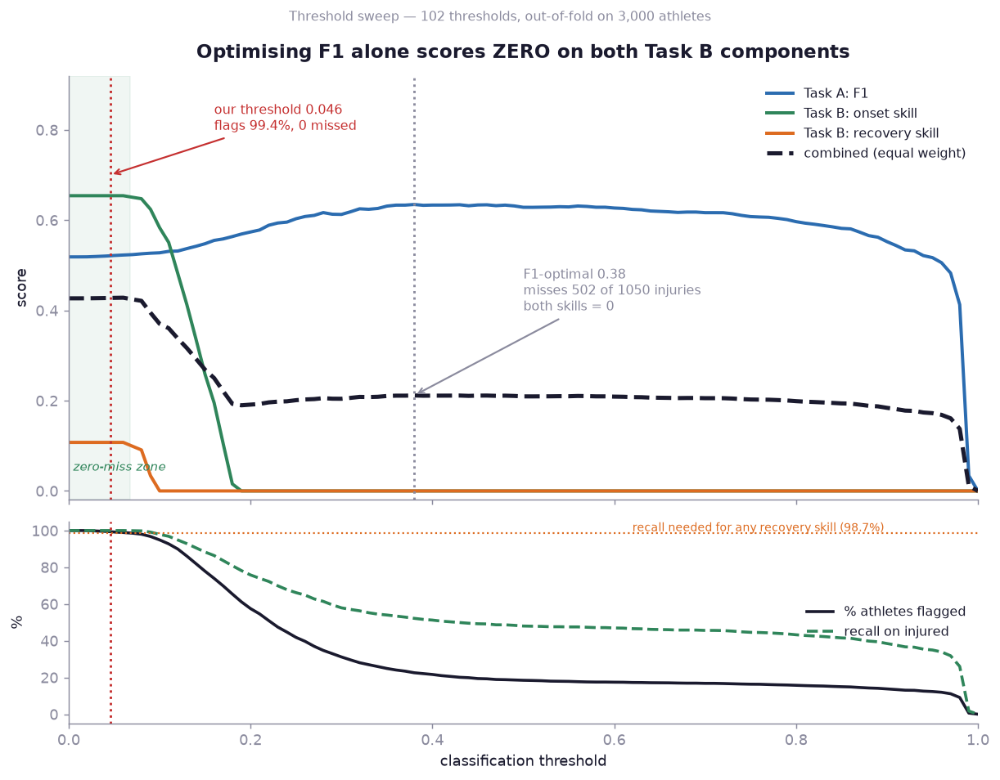
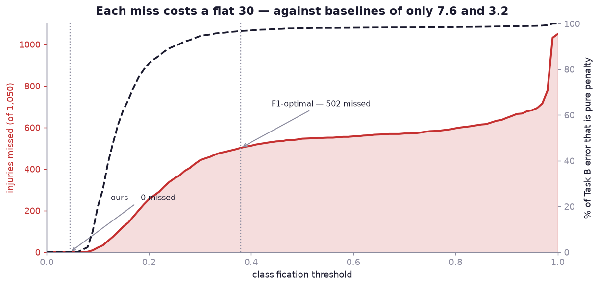
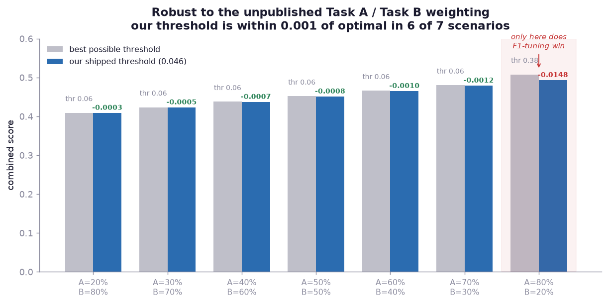

# PlayHack ML Track 2026 — Athlete Injury Risk Prediction

[](https://unstop.com/competitions/playhack-ml-track-iit-guwahati-1739468)
[](https://www.python.org/)
[](#results)

Given **30 days** of an athlete's wearable and training data, predict what happens
in the **next 30 days**: whether they get injured, which day it starts, and how
long it sidelines them.

```bash
pip install -r requirements.txt
python predict.py --data-root data --split test    # → submission.csv
```

---

## Results

Scored with the organisers' own metric ([PDF p.6](docs/problem_statement.md)),
out-of-fold over 3000 athletes. "Ceiling" is the expected score of a
perfectly-calibrated model with the same information — see [the caveat](#about-the-ceiling).

| | scored quantity | **ours** | ceiling | closed |
|---|---|---|---|---|
| **Task A** | F1 | **0.5210** | 0.5246 | 99.3% |
| **Task B** | skill — `onset_day_offset` | **0.6541** | 0.6647 | 98.4% |
| **Task B** | skill — `recovery_duration` | **0.1075** | 0.1329 | 80.9% |
| | balanced mean of the three | **0.4275** | 0.4407 | **97.0%** |

Underlying errors: onset MAE **2.634** vs a 7.615 baseline, recovery MAE **2.893**
vs 3.242. ROC-AUC is **0.7625** (ceiling 0.7702) — a diagnostic only; it is not
part of the scoring rule.

**Why F1 0.52 is not a weak result.** At full recall, F1 is pinned by prevalence
to `2p/(1+p)` = **0.5185** at 35%. Deriving the Bayes optimum straight from the
data generating process ([`src/generator_ceiling.py`](src/generator_ceiling.py),
no model involved) puts the best achievable F1 under this metric at **0.5226** —
we score 0.5210, **99.7%** of it. The low number is the metric's incentive
structure, not the model. That same model-free analysis independently reproduces
our decision: **Bayes-optimal play flags 99.0% of athletes**, and chasing F1
instead would halve the total score (0.4195 → 0.2101).

---

## The one decision that mattered

The metric penalises a **missed** injury with a flat **30** on both timing heads.
The baselines it compares you against are only **7.61** and **3.24**. So one miss
destroys roughly four good onset predictions, or **nine** recovery ones. A false
positive, meanwhile, is not even in Task B's evaluation set — it costs nothing there.

Break-even recall — below this, a skill score is literally zero:

| head | baseline MAE | recall needed |
|---|---|---|
| `onset_day_offset` | 7.61 | 0.82 |
| `recovery_duration` | 3.24 | **0.99** |

So the natural instinct — tune the threshold for F1 — is a trap:

| threshold | pos rate | recall | F1 | skill_on | skill_rc | mean |
|---|---|---|---|---|---|---|
| 0.38 — **F1-optimal** | 0.216 | 0.512 | **0.635** | 0.000 | 0.000 | 0.211 |
| **0.045 — shipped** | 0.994 | **1.000** | 0.521 | **0.654** | **0.108** | **0.428** |

Optimising F1 alone scores **0.000** on two of the three components. Trading
0.11 of F1 for 0.76 of skill roughly **doubles** the balanced score. We flag
almost every athlete and exclude only the ~0.6% we are most confident are healthy.



This was tested, not assumed: a full out-of-fold sweep over **102 thresholds**
at 0.01 resolution ([`src/threshold_sweep.py`](src/threshold_sweep.py), raw table
in [`reports/threshold_sweep.csv`](reports/threshold_sweep.csv)). Recall is a
cliff, not a gentle trade — **one** missed injury out of 1,050 measurably dents
recovery skill, and 22 zero it:

| threshold | flagged | **missed** | F1 | skill_on | skill_rc | % of Task B error that is pure penalty |
|---|---|---|---|---|---|---|
| **0.046 (ours)** | 99.4% | **0** | 0.5210 | 0.6541 | 0.1075 | 0% |
| 0.07 | 98.6% | 1 | 0.5236 | 0.6507 | 0.0992 | 1.1% |
| 0.10 | 94.9% | 22 | 0.5276 | 0.5833 | **0.0000** | 19.8% |
| 0.38 (F1-optimal) | 22.6% | **502** | 0.6346 | 0.0000 | 0.0000 | 82.6% |



Past a threshold of ~0.2, most of the Task B error is no longer prediction error
at all — it is accumulated miss penalties.

This is not a hack to game the metric: **a perfectly-calibrated oracle makes the
same trade**, giving up 0.114 F1 to gain 0.798 skill ([`src/official_ceiling.py`](src/official_ceiling.py)).

Since the PDF never says how Task A and Task B combine, the choice is stress-tested
across seven weightings. Our threshold ranks **3rd or 4th of 102** in six of them,
within **0.001** of the best possible score:



| weighting | best thr | our gap | rank |
|---|---|---|---|
| A=20% … A=70% | 0.06 | −0.0003 … −0.0012 | 3-4 / 102 |
| **A=80% / B=20%** | **0.38** | **−0.0148** | **48 / 102** |

Honest caveat: at A=80% we *are* suboptimal and 0.38 would be the better call.
The PDF presents Task A and Task B as co-equal sections, so we take the balanced
read. We also keep 0.046 rather than the marginally better 0.06 deliberately —
the lowest-scoring truly-injured athlete sits at 0.068, so 0.046 leaves a 33%
safety margin to the miss-cliff while 0.06 leaves 12%, and the score difference
is 0.0006.

---

## How it works

**The trap in the data.** Train has 60 days per athlete; test has 30. Days 31-60
*are* the risk window being predicted. Any feature built from them leaks the
answer and cannot exist at test time.


Everything is clipped to days 1-30, enforced by an assertion at build time and a
[test](src/test_leakage.py) with a negative control that must fail if the guard
is removed.

**Injury is two mechanisms, not one.** Athletes split into a background hazard
(~23% injury rate) and an overload hazard, separated by **ACWR** — acute:chronic
workload ratio, this week's training load over the recent baseline. Ramp up too
fast and risk spikes.


`load_acwr` and `load_strain` separate injured from healthy into two visibly
distinct populations, while sleep and raw activity totals barely move. That is
why the features are built around ACWR, monotony and strain rather than step
counts — and reading the generator back out of the data confirms it: above
`steps_acwr` 1.64 the injury rate is **1.0000**, 300 athletes, zero exceptions.

**The models.** 223 leak-safe features → 20-35 selected per head *inside* each
fold → LightGBM + XGBoost + CatBoost, blended with weights fitted on out-of-fold
predictions, over 3 seeds × 5 folds. L1 objectives for the day-count heads, since
MAE wants the conditional median.

**When simple won.** For `recovery_duration`, a cross-fitted sport+gender median
(MAE 2.898) beat all three tree models (2.92-2.96). Rather than discard the trees,
it joins them as a fourth blend candidate and takes ~58% of the weight.

---

## What didn't work

- **AFT survival model** — treating healthy athletes as right-censored. Sound in
  theory, worse in practice ([`src/survival.py`](src/survival.py)).
- **All 223 features** — beaten by the top 35. More features, more noise.
- **TabPFN** — blocked by a one-time license click-through its package now requires.
- **AutoGluon** (`best_quality`) — genuinely competitive, winning 2 of 3 heads on
  the older AUC/MAE framing. Not shipped: its edge under the *real* metric is
  ~0.008 skill, against a 274 MB artifact. Details in [RESULTS.md](RESULTS.md).

---

## About the ceiling

These labels are partly random: two athletes with identical data can land on
opposite outcomes. So no model reaches a perfect score, and "how close are we to
the best *possible*" is more useful than a raw number.

It is computed **two independent ways** — once from the model's own out-of-fold
predictions, and once analytically from the reverse-engineered data generating
process with no model involved ([`src/generator_ceiling.py`](src/generator_ceiling.py)):

| | ours | data-derived Bayes | model-conditioned | ceiling used | closed |
|---|---|---|---|---|---|
| F1 | 0.5210 | 0.5226 | 0.5246 | 0.5246 | 99.3% |
| skill_onset | 0.6541 | 0.6285 | 0.6647 | 0.6647 | 98.4% |
| skill_recovery | 0.1075 | 0.1073 | 0.1329 | 0.1329 | 80.9% |
| mean of three | 0.4275 | 0.4195 | 0.4407 | 0.4407 | 97.0% |

The model-free route independently reproduces the threshold decision:
**Bayes-optimal play flags 99.0% of athletes**, and playing for F1 instead halves
the achievable score (0.4195 → 0.2101). It also pins F1: at full recall F1 is
`2·prevalence/(1+prevalence)` = 0.5185, so 0.52 is a ceiling, not a weak model.

Treat a ceiling as an **estimate of irreducible error, not a proven bound** — and
one that is only as good as its estimator. Two earlier versions of this analysis
conditioned on less information than the model they were bounding (one feature,
then eight), which made the model appear to score *113%* and then *108.9%* of
"maximum". That signals a bad bound, not a good model. Both ceiling scripts now
warn whenever a score exceeds them, and the reported ceiling is the tightest
estimate across methods.

---

## Repository

**Round 1 deliverables**

| | |
|---|---|
| [`playhack_ml_submission.zip`](playhack_ml_submission.zip) | the submission archive — models + code + `submission.csv`, 2.9 MB. Verified by extracting clean and reproducing the CSV byte-identically |
| [`PlayHack_ML_Round1_Submission.pptx`](PlayHack_ML_Round1_Submission.pptx) | the deck, 14 slides |
| [`submission.csv`](submission.csv) | predictions for all 1,100 test athletes |
| [`readme.txt`](readme.txt) | judge-facing guide: run steps, verification, disclosures |

**Code**

| | |
|---|---|
| [`predict.py`](predict.py) | inference: raw CSVs → `submission.csv` |
| [`models/`](models/) | persisted models + `manifest.json` (features, weights, threshold, versions) |
| [`src/score.py`](src/score.py) | the official metric, implemented verbatim + self-check |
| [`src/features.py`](src/features.py) | feature engineering + leakage guard |
| [`src/threshold_sweep.py`](src/threshold_sweep.py) | the 102-threshold sweep and weighting sensitivity |
| [`src/rethreshold.py`](src/rethreshold.py) | threshold selection against the metric |
| [`src/generator_ceiling.py`](src/generator_ceiling.py) | model-free Bayes ceiling from the generator |
| [`src/build_final_models.py`](src/build_final_models.py) | refit on all data, persist artifacts |

**Write-ups**

| | |
|---|---|
| [`RUNME.md`](RUNME.md) | how to run everything |
| [`RESULTS.md`](RESULTS.md) | full tables, per-model breakdown, SOTA benchmark |
| [`docs/findings.md`](docs/findings.md) | numbered findings, incl. negative results |
| [`docs/methodology.md`](docs/methodology.md) | **the long-form explanation of every decision** |
| [`docs/problem_statement.md`](docs/problem_statement.md) | the brief and the metric, transcribed |
| [`reports/threshold_sweep.csv`](reports/threshold_sweep.csv) | raw 102-row sweep, every column |

Full retraining pipeline and checks: see [RUNME.md](RUNME.md).

---

*Round 1 submission, PlayHack ML Track 2026, IIT Guwahati.*
